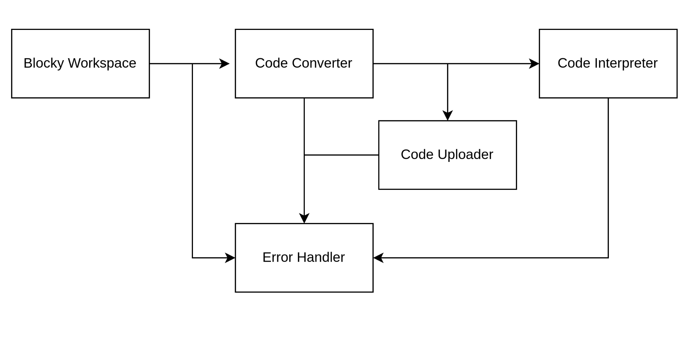

# **Software** **Design Document**

## Version

| Version | Date | Status |
| ---| ---| --- |
| 1.0 | 09/04/2024 | Approval Pending |
|  |  |  |

## Reference

[Software Requirement Specification](SRS.md)

## Introduction

### Purpose

This document outlines the design and architecture of Obo Blocks, a Scratch Blocks to Python code converter with code evaluation using Pydiode. Obo Blocks aims to facilitate the transition from visual programming to text-based programming for students and teachers at Roboticgen Academy

### Scope

Obo Blocks will allow users to convert programs written in Scratch Blocks into Python code and provide code interpretation capabilities with limited libraries using Pydiode. Additionally, it will support micropython extension, enabling users to run their Python code directly within the web interface and upload generated code to ESP32 Development Board (MagicBit).

## Design and Architecture

### System Overview

The system is for students who have no prior knowledge of Python-related programming to program ESP32 using Scratch Blocks.

### Architectural Style

The Monolithic Architecture will be used for the system.

### Components

*   **Blockly Workspace** : Responsible for providing the interface for building programs using Scratch Blocks

*   **Code Converter** : Responsible for converting Scratch Blocks programs into Python code.

*   **Code Interpreter** : Utilizes Pydiode for executing Python code within the browser environment.

*   **Code Uploader** : Responsible for uploading generated code to ESP32 Development Board (MagicBit).

*   **Error Handler** : Handles errors and provides informative messages to users.

#### Component Communication

### Data Flow

## Technology Stack

The technology stack of obo blocks will be as follow

### Frontend Technologies

*   Programming Languages : HTML,CSS and JavaScript.

### External APIs and Services

*   Third-Party APIs: Blocky,Pydiode

### Development Tools and Utilities

*   IDE/Code Editor : VS Code
*   Version Control : Git/Github
*   Project Management : ClickUp

## Deployment

### Infrastructure and DevOps

Hosting/Cloud Provider : Netlify for Development and AWS for Deployment

### Deployment Diagram

## Interfaces

#### User Interface

#### 

## Dependencies

*   [Blocky](https://developers.google.com/blockly)
*   [Python](https://www.python.org/)
*   [Pydiode](https://pyodide.org/en/stable/)

  